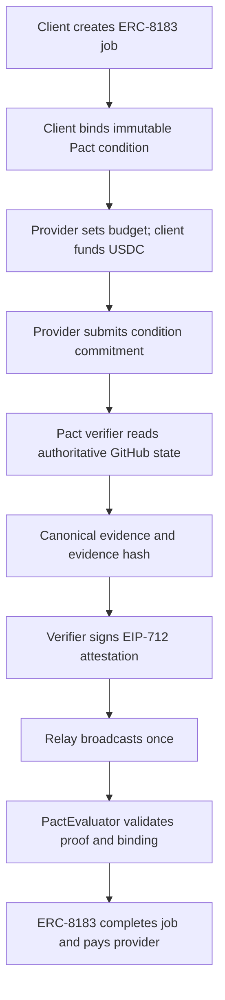

# Pact production architecture

Pact turns objectively verifiable outcomes into ERC-8183 settlement decisions.
The production MVP supports GitHub `PR_MERGED` on Arc and keeps verification
authority, transaction broadcasting, and financial custody separate.

## Authority boundaries

| System        | Owns                                                                                                                             |
| ------------- | -------------------------------------------------------------------------------------------------------------------------------- |
| Pact protocol | Canonical condition, evidence, job identity, and attestation commitments                                                         |
| Pact verifier | Authoritative GitHub re-read and positive EIP-712 attestation                                                                    |
| Pact relay    | One observable broadcast of an already authorized attestation                                                                    |
| PactEvaluator | Immutable condition binding, verifier enforcement, replay protection, and ERC-8183 completion call                               |
| ERC-8183      | Client/provider/job, budget, USDC custody, submission, completion/rejection/expiry, payout/refund, and canonical financial state |

PactEvaluator never holds or accounts for the job budget. The operational
database coordinates work and projections; it is not canonical financial state.

## Production flow

The verifier signs only a satisfied condition. A false, pending, or unavailable
condition remains retryable; Pact does not reject the underlying ERC-8183 job.

## Components

- **Next.js web/API:** product UI, wallet authentication, transaction
  preparation, public projections, and the static Proof Center.
- **PostgreSQL:** durable drafts, wallet actions, verification attempts,
  evidence, attestations, relay intents, and reconciliation state.
- **Verifier worker:** validates canonical chain prerequisites, independently
  queries GitHub, creates Evidence V1, and signs Attestation V2 with a dedicated
  verifier key.
- **Relay worker:** owns a distinct low-value transaction signer, serializes
  nonces, broadcasts at most once, and reconciles ambiguous results.
- **PactEvaluator:** binds one condition and verifier snapshot to an open job,
  verifies the signed completion proof, and calls the pinned ERC-8183 contract.
- **ERC-8183 proxy:** owns the job lifecycle and USDC escrow.

## Mainnet deployment

- Network: Arc Mainnet (`5042`)
- ERC-8183 proxy: `0x9Da745D2A6e03b049bdAE5aE7a193f1B00E520d6`
- ERC-8183 implementation: `0x4B46C1aa98B1d82cF4eeFFDDD129a57402851901`
- PactEvaluator: `0x3fd3AC5bE6eE41DcD11233833DCD96c21F3b1129`
- USDC: `0x3600000000000000000000000000000000000000`

Exact bytecode, role, release, and Testnet-first certification provenance is
preserved in the immutable deployment manifests and certified kernel.

## Failure safety

- Conditions are deterministically serialized and immutably bound before
  funding.
- The verifier and relay use different keys and capabilities.
- GitHub webhooks and client claims are hints only; the verifier re-reads the
  authoritative API.
- Idempotency and compare-and-swap transitions prevent duplicate actions.
- An RPC timeout is ambiguous, not failure: reconciliation checks transaction
  hash, sender/nonce, receipt, events, and canonical contract state before any
  retry.
- Expired unsent attestations lose broadcast capability before replacement.
- Release gates fail closed on source, dependency, manifest, bytecode, signer,
  role, or network drift.
- Public proof artifacts are immutable, schema-validated, fingerprinted, and
  contain no runtime secrets.

## Evidence

- [Arc Mainnet Job #2 canonical proof](PHASE8_MAINNET_JOB2_PROOF.md)
- [Arc Testnet Job #6 proof](PHASE8_TESTNET_JOB6_PROOF.md)
- [Certified settlement kernel](CERTIFIED_KERNEL.md)
- [Security model](SECURITY_MODEL.md)
- [GitHub verification](GITHUB_VERIFICATION.md)
- [Railway deployment](RAILWAY_DEPLOYMENT.md)
