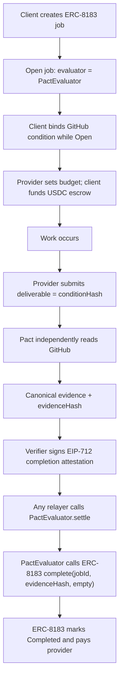
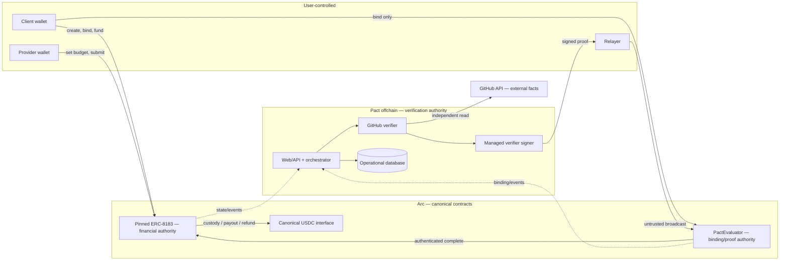

# Pact MVP architecture

Status: Updated through the passing Phase 4A.1 PostgreSQL durability gate;
pending Tech Lead review before Phase 4B.  
Compatibility source record: `docs/ERC8183_COMPATIBILITY.md`.

## Core correction

Pact is not an escrow contract. ERC-8183 owns financial execution; Pact is a
positive, deterministic evaluation layer.

```text
ERC-8183                              Pact
----------------------------------    ----------------------------------
client / provider / evaluator         objective condition
job identity and lifecycle            immutable condition binding
budget and USDC custody               independent GitHub verification
provider submission                   canonical evidence and commitment
completion / rejection / expiry       EIP-712 positive attestation
payout / refund                       deterministic PactEvaluator
canonical financial state             accepted-proof replay state
```

PactEvaluator never receives, accounts for, withdraws, refunds, or transfers the
ERC-8183 job budget. Its only financial effect is an authenticated call to the
pinned commerce contract's `complete(...)` function.

## Canonical flow



## Components and trust boundaries



The relayer has broadcast capability but no verification authority. The verifier
has completion authority only through a signature valid for an exact bound job.
ERC-8183 alone has financial authority. The application/database is a projection
and coordinator.

## ERC-8183 compatibility boundary

ERC-8183 is Draft. Phase 1 must lock its fixture/interface to:

- normative draft source: `ethereum/ERCs` commit
  `a078cab5cc8e9581c15f76c091ed96eed28f02f7`;
- reference implementation candidate: `erc-8183/base-contracts` commit
  `142e669c1fd318486a4628395b629f033654dd06`.

The reference commit—not its `main` branch name—is the Phase 1 compatibility
fixture. The exact deployment target remains unresolved. Arc's older testnet
tutorial uses another ABI and address and is not compatible evidence for
Mainnet.

PactEvaluator imports or defines only the exact local interface needed from the
pinned implementation:

```solidity
interface IPactERC8183 {
    enum JobStatus { Open, Funded, Submitted, Completed, Rejected, Expired }

    // Exact Job tuple is pinned to reviewed commit 142e... in Phase 1.
    function getJob(uint256 jobId) external view returns (Job memory);

    function complete(
        uint256 jobId,
        bytes32 reason,
        bytes calldata optParams
    ) external;
}
```

Pact reads only `client`, `status`, `expiredAt`, and `evaluator`; it calls only
`complete`. It does not expose the rest of the reference implementation as Pact
features. Phase 1 must assert selectors, tuple layout/status ordinals, and
behavior against the exact pinned fixture.

Each PactEvaluator deployment targets one immutable `commerceContract`. This is
smaller and safer than a mutable registry. A different commerce deployment or
ABI gets a separately reviewed PactEvaluator deployment/version. The commerce
address remains explicit in job keys, events, and signed attestations even
though it is immutable configuration.

An upgradeable ERC-8183 proxy can change semantics behind the same address.
Therefore a production deployment manifest must pin and monitor proxy and
implementation code hashes and admin state. Prefer a safely frozen/immutable
deployment after configuration; do not assume a reference proxy is immutable.

## Job identity

`jobId` is local to one ERC-8183 deployment. Pact's canonical identity is:

```text
PactJobIdentity(
  uint8 schemaVersion = 1,
  uint256 chainId,
  address commerceContract,
  uint256 jobId
)
```

The human tuple is `(chainId, commerceContract, jobId)`. The deterministic
database/event key is:

```text
typeHash = keccak256(UTF8(
  "PactJobIdentity(uint8 schemaVersion,uint256 chainId,address commerceContract,uint256 jobId)"
))

jobKey = keccak256(abi.encode(
  typeHash,
  uint8(1),
  uint256(chainId),
  address(commerceContract),
  uint256(jobId)
))
```

Chain and job IDs must be positive uint256 values; the commerce address must be
valid and nonzero. The protocol package implements and tests this
representation. Onchain, `block.chainid` supplies the chain value; no
caller-provided chain ID is trusted.

Published Phase 0.5 vector:

```text
schemaVersion    = 1
chainId          = 5042
commerceContract = 0x1111111111111111111111111111111111111111
jobId            = 81
jobKey           = 0x3fc68520644941b41fc25c71eda15a50c082760a14b99b90f39864ded7975ea7
```

## PactEvaluator responsibilities

Phase 2 implements immutable commerce targeting, job identity, condition
binding, verifier snapshots, rotation/revocation, and positive completion. The
evaluator:

- store one immutable commerce contract address;
- maintain one immutable condition binding per job key;
- snapshot the authorized verifier for each binding;
- validate positive EIP-712 completion attestations;
- enforce exact job/deployment/condition/evidence/time/signer/status/evaluator
  constraints;
- enforce Pact-level single acceptance and digest replay protection;
- emit condition-bound and completion-accepted events;
- call `commerceContract.complete(jobId, evidenceHash, bytes(""))` atomically;
- permit any caller to relay a valid proof;
- support a narrow default-verifier rotation and irreversible emergency verifier
  revocation policy.

It must not custody tokens, mirror budgets, calculate payouts/fees, implement
refunds/rejection/expiry, change ERC-8183 state except through `complete`, parse
GitHub, store verbose evidence, accept client claims, or implement ERC-8004,
hooks, claims, disputes, upgradeability, or generic condition providers.

## Immutable job-condition binding

Implemented Phase 1 binding surface:

```solidity
function bindCondition(
    uint256 jobId,
    bytes32 conditionHash,
    uint64 completionDeadline,
    address expectedVerifier
) external;
```

`commerceContract` is omitted from the arguments because it is immutable
PactEvaluator configuration, but is included in the derived job key and emitted
event. Binding must:

1. read the job from the immutable commerce contract;
2. require the job exists and is exactly `Open`;
3. require `msg.sender == job.client`;
4. require `job.evaluator == address(this)`;
5. reject zero `conditionHash` and invalid/zero job identity;
6. require `block.timestamp < completionDeadline < job.expiredAt`;
7. require the job key has no prior binding;
8. require `expectedVerifier` to equal the current nonzero, non-revoked default
   verifier;
9. snapshot `expectedVerifier` as the job's immutable verifier;
10. store and emit the immutable binding.

The binding cannot change or be deleted. Only the client can establish it, so a
third party cannot front-run. Requiring the wallet-reviewed `expectedVerifier`
also prevents an admin rotation between transaction construction and inclusion
from silently changing the key authorized for that job. Binding only in `Open`
proves every settleable Pact job was bound before funding. PactEvaluator does
not prevent a client from funding an unbound external job; that job simply can
never be completed through Pact and must resolve through ERC-8183. The UI must
block that unsafe sequence, but no extra hook is added solely for UX
enforcement.

Implemented binding storage (the `accepted` bit is added in Phase 2):

```solidity
struct ConditionBinding {
    bytes32 conditionHash;
    uint64 completionDeadline;
    address verifier;
    bool accepted;
}

mapping(bytes32 jobKey => ConditionBinding) bindings;
mapping(address verifier => bool) revokedVerifiers;
mapping(bytes32 attestationDigest => bool) usedAttestations;
```

The evaluator also stores the future-binding `defaultVerifier`; commerce and
admin addresses are immutable. No financial or duplicate ERC-8183 state is
stored.

## Deadline and expiry model

```text
bind time < completionDeadline < ERC8183.expiredAt
```

- `completionDeadline` defines when the GitHub outcome must objectively occur.
- `expiredAt` is the ERC-8183 financial/liveness boundary.
- Their difference is the client-chosen settlement grace window.

PactEvaluator requires `satisfiedAt <= completionDeadline`,
`validUntil < expiredAt`, and `block.timestamp <= validUntil`. It also re-reads
the job and requires `Submitted` immediately before completion. Pact imposes
`expiredAt` as its hard completion upper bound even if a pinned commerce
implementation supplies an additional post-expiry evaluator grace period.

No Pact refund timestamp or refund function exists. At expiry, the underlying
ERC-8183 version determines refund eligibility and transaction ordering. A
completion and expiry transaction can race near the boundary; only the executed
canonical state transition wins.

## Provider submission model

The provider calls the pinned ERC-8183:

```text
submit(jobId, deliverable = conditionHash, optParams = empty)
```

`conditionHash` remains the promise; the submission is the provider's explicit
readiness signal for that promise. The `JobSubmitted` event supplies the exact
commerce deployment and job context. It does not prove the GitHub condition.

The current reference job view does not retain the deliverable. The verifier
must therefore reconcile the canonical `JobSubmitted` event for the transition
and require its deliverable to equal the binding's condition hash before
signing. The signed condition hash makes that check attributable to the trusted
verifier. If a future ERC-8183 target stores/query-exposes the deliverable,
using it requires a versioned compatibility update, not an ABI guess.

## Positive-only attestation V2

EIP-712 domain:

```text
name              = "Pact"
version           = "2"
chainId           = block.chainid
verifyingContract = PactEvaluator address
```

Primary type:

```text
PactCompletionAttestation(
  address commerceContract,
  uint256 jobId,
  bytes32 conditionHash,
  bytes32 evidenceHash,
  uint64 satisfiedAt,
  uint64 verifiedAt,
  uint64 validUntil
)
```

Solidity uses OpenZeppelin Contracts `v5.6.1` `EIP712` and `ECDSA` (pinned in
`packages/contracts/SOLIDITY_DEPENDENCIES.lock`) for runtime domain separation,
low-s enforcement, valid-v handling, and recovery. The protocol package uses
viem. Both reproduce the fixed values in `ATTESTATION_V2_VECTOR.md`.

There is no `result`: this type means positive completion by definition. Pact
does not sign negative or indeterminate outcomes. There is no caller-provided
`replayId`: the EIP-712 digest is the deterministic attestation ID and is
consumed on acceptance.

Contract checks, in addition to strict non-malleable signature recovery:

- payload commerce equals the evaluator's immutable commerce address;
- job binding exists and is not already accepted;
- payload condition equals the binding;
- evidence hash is nonzero;
- recovered signer equals the binding's verifier and is not revoked;
- `satisfiedAt <= completionDeadline`;
- `satisfiedAt <= verifiedAt <= block.timestamp <= validUntil`;
- `validUntil < job.expiredAt`;
- job is `Submitted` and its evaluator is this PactEvaluator;
- attestation digest has not been used.

After checks, set `binding.accepted = true` and consume the digest before the
external call, then call ERC-8183. A revert from ERC-8183 reverts those effects,
so the same valid proof can be retried after a transient external failure. A
successful transaction persists both Pact replay barriers and ERC-8183's
terminal state and emits `PactCompletionAccepted`. The contract re-reads the job
after the call and requires `Completed`; a no-op return reverts atomically.

No global reentrancy guard is required for this narrow surface. The digest and
binding effects precede the call, so same-digest and alternate-digest callbacks
for the same binding fail. Cross-job relay remains intentionally permissionless,
and admin-only methods remain caller-gated.

## Replay boundaries

| Replay attempt                           | Protection                                                |
| ---------------------------------------- | --------------------------------------------------------- |
| Same signature twice                     | `usedAttestations[digest]` plus `binding.accepted`.       |
| New signature for same job               | `binding.accepted`.                                       |
| Same job ID on another commerce contract | Signed `commerceContract`, immutable target, and job key. |
| Same job ID on another chain             | EIP-712 domain `chainId` and canonical job key.           |
| Another PactEvaluator deployment         | EIP-712 `verifyingContract`.                              |
| Another condition/evidence               | Signed hashes and immutable binding equality.             |
| Stale proof                              | `validUntil` and ERC-8183 expiry checks.                  |

This does not rely solely on ERC-8183 terminal state.

## Verifier authority and rotation

V1 uses one default centralized verifier for new bindings. Binding snapshots
that verifier, so rotating the default key does not grant a new key authority
over already funded jobs.

Minimal lifecycle:

- admin changes `defaultVerifier` for future bindings only;
- old snapshots remain valid unless the old verifier is explicitly revoked;
- revocation is irreversible and blocks that key for every unsettled binding;
- no replacement key is injected into a funded binding;
- jobs disabled by emergency revocation must eventually follow ERC-8183 expiry.

This trades liveness for predictable authority and compromise containment. The
admin can deny Pact completion by revocation but cannot redirect escrow or call
ERC-8183 rejection through Pact. No registry, governance, multisig, upgrade
framework, or per-job admin replacement belongs in the MVP. Production admin
custody remains a deployment-review requirement.

## Relayer model

`completeWithAttestation(attestation, signature)` is permissionless. A Pact
backend, client, provider, or third-party relayer may pay Arc gas. `msg.sender`
grants no settlement authority and is not a signed field; the signature and
immutable binding decide authority. ERC-8183 sees `msg.sender == PactEvaluator`,
which is the evaluator configured on the job.

Duplicate relay attempts are safe but may spend gas: only one can succeed.
Orchestration still uses durable idempotency and must reconcile timeouts by
transaction hash, sender/nonce, Pact events, and ERC-8183 state before retrying.

## Condition commitment

Phase 0 condition schema/version/hash is unchanged:

```text
GithubPrMergedCondition(
  uint8 schemaVersion,
  string provider,
  string repository,
  uint64 pullRequest,
  string baseBranch,
  string event
)
```

Repository identity is lowercase; base branch is exact/case-sensitive; provider
is `github`; event is `PR_MERGED`; unsupported/ambiguous input fails closed. The
published flagship vector remains:

```text
github / pact-protocol/demo / PR 81 / main / PR_MERGED
0x3da848928dfb0c9f0e98058ec9dc003e1a73952469488ce90fcab1699ccb18b4
```

See `packages/protocol/src/condition.ts` for the exact typeHash/ABI/Keccak
construction. Frontend JSON never defines cryptographic semantics.

## Evidence model

Canonical GitHub evidence V1 is:

```text
PactGitHubPrMergedEvidence(
  uint8 schemaVersion,
  bytes32 conditionHash,
  string repository,
  uint64 pullRequest,
  string baseBranch,
  bytes20 mergeCommitSha,
  uint64 mergedAt,
  uint64 observedAt
)
```

No chain/job fields are added: GitHub evidence proves an external fact, while
the EIP-712 attestation binds that evidence to the exact ERC-8183 job.
`mergedAt == satisfiedAt`. The signed `evidenceHash` is passed as ERC-8183
`complete` reason, so the canonical `JobCompleted` event carries the link to
Pact's immutable offchain evidence.

| Representation        | Location                                                           |
| --------------------- | ------------------------------------------------------------------ |
| Typed evidence fields | Immutable/versioned offchain evidence record                       |
| `evidenceHash`        | Attestation, Pact acceptance event, ERC-8183 completion reason, DB |
| Raw GitHub response   | Restricted audit/diagnostic storage; not canonical hash input      |
| Human projection      | UI/API recomputed from typed evidence                              |

The exact encoding and fixed vector are published in
`GITHUB_EVIDENCE_V1_VECTOR.md`. The implemented verifier uses the pinned GitHub
REST API version `2026-03-10`, manually rejects redirects, obtains PR metadata
and the dedicated merge check independently, and signs only when they agree. See
`GITHUB_VERIFICATION.md` for the HTTP, failure, clock, and signer contracts.

## Authoritative state hierarchy

| State/fact                                                                                 | Authority                                                            |
| ------------------------------------------------------------------------------------------ | -------------------------------------------------------------------- |
| Client, provider, evaluator, token, budget, `expiredAt`, job status, escrow, payout/refund | Pinned ERC-8183 contract                                             |
| Job-condition/deadline/verifier binding and Pact replay acceptance                         | PactEvaluator                                                        |
| Signed positive verification decision                                                      | Snapshotted Pact verifier key                                        |
| Repository/PR/base/merge facts                                                             | GitHub, as independently observed by Pact verifier                   |
| Evidence preimage                                                                          | Immutable offchain evidence whose hash matches both contracts/events |
| Attempt/transaction lifecycle                                                              | Database projection reconciled with RPC/contracts                    |
| Presentation                                                                               | Frontend only; never authoritative                                   |

The database declares payment complete only after a final receipt and ERC-8183
`Completed` state/events. PactEvaluator never projects itself as escrow
authority.

## Failure classes

### Definitive

- final ERC-8183 `Completed`, `Rejected`, or `Expired` state;
- final revert receipt for one transaction;
- valid GitHub response proving a particular observation;
- cryptographic/contract rejection caused by wrong domain/job/binding/signer or
  expired timestamps.

### Retryable or time-dependent

- not-yet-merged before `completionDeadline`;
- GitHub/RPC rate limit, timeout, outage, or ambiguous authorization;
- verifier/signer service failure;
- ERC-8183 not yet `Submitted` before expiry;
- a reverted relay whose cause is transient and whose canonical job remains
  eligible.

### Ambiguous

- missing send response or transaction hash;
- hash exists without final receipt;
- provider disagreement about pending transaction;
- stale/missing database projection.

An attestation can be cryptographically valid yet unusable because ERC-8183 is
not `Submitted`, names another evaluator, is terminal, or the transaction misses
`expiredAt`. Those are state/precondition failures, not forged evidence.

## Persistence and orchestration

Phase 4A stores Pact records, webhook delivery identities, explicit operations,
append-only verification attempts, canonical evidence, same-block Arc
reconciliations, and immutable prepared attestations. PostgreSQL constraints
enforce semantic job identity, delivery deduplication, one active operation,
unique evidence/digests, and one active prepared artifact per Pact binding.

The implemented operation stops at `READY_TO_RELAY`. It contains no wallet
client, sender key, nonce, transaction intent, or broadcast call. Phase 4B must
introduce transaction intent persistence and ambiguous-broadcast reconciliation
without weakening this signing gate. See `PHASE4A_DURABILITY.md`.

## Arc configuration

Reconfirmed from current official sources on 2026-09-28:

| Value                 | Arc Mainnet                                              |
| --------------------- | -------------------------------------------------------- |
| Public launch         | 2026-09-16                                               |
| Chain ID              | `5042`                                                   |
| Primary RPC           | `https://rpc.mainnet.arc.io`                             |
| Explorer              | `https://explorer.arc.io`                                |
| Native gas currency   | USDC, 18-decimal native interface                        |
| USDC ERC-20 interface | `0x3600000000000000000000000000000000000000`, 6 decimals |

No official canonical ERC-8183 Mainnet address was verified. It remains blank
configuration. See `ERC8183_COMPATIBILITY.md` for classification and conflicts.

All deployment values form one validated environment object: chain ID, RPC,
explorer, USDC interface/decimals, ERC-8183 address and compatibility manifest,
PactEvaluator address/domain version, and finality policy. Server startup fails
closed on mismatch. Browser-safe copies are validated against server/chain data.

## Likely deployment topology

One Next.js application/server, explicitly invoked durable processing actions,
one PostgreSQL database, one managed verifier signer, optional GitHub API token,
GitHub webhook secret, Arc RPC, one PactEvaluator deployment, and one explicitly
reviewed ERC-8183 commerce deployment. Secrets remain server-side.

No microservice mesh, generic queue framework, multi-chain registry, ERC-8004,
or Pact custody contract is justified for the MVP.
